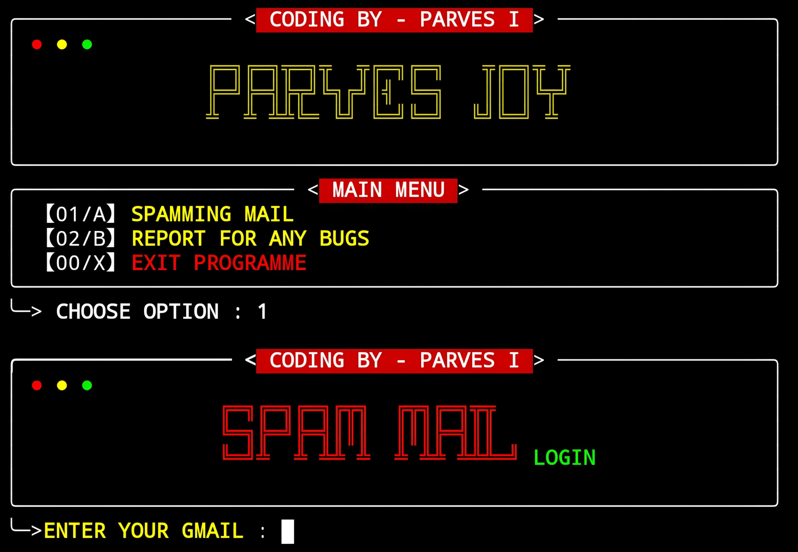

# GMAIL BOMB 💣 

A simple, lightweight Python script designed for Termux. This script performs Gmail messages spamming and can be easily used on Android via the Termux app.

## Features

- Lightweight and efficient
- Designed for use in Termux on Android
- [Use at your own risk]

## Prerequisites

Before using this script, make sure you have:

- Termux installed on your Android device
- Python 3 installed in Termux
- Requests module

## Installation

1. **Clone the repository** to your Termux environment:

```
apt update && upgrade -y
pkg install git
pkg install python
git clone --depth=1 https://github.com/JOY-XII/Gmail-bomb.git
cd Gmail-bomb
python Mail-Spam.py
```
## Tool outlook 


   
